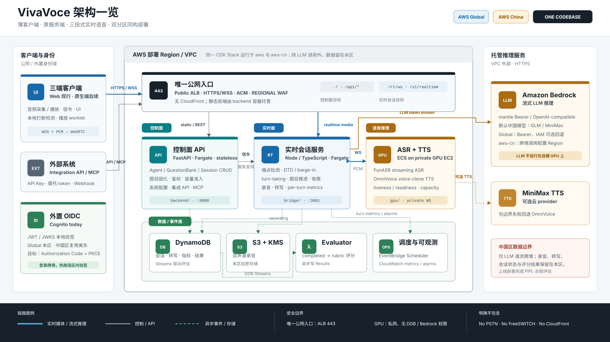

# VivaVoce

VivaVoce is a self-hosted real-time voice assessment platform. It combines a
web client, a control-plane API, a real-time session service, GPU-based speech
inference, configurable LLMs, and asynchronous evaluation.

The core model is intentionally general:

- an **Agent** defines persona, instructions, scoring rubric, and voice settings;
- a **Question Bank** defines reusable questions and reference material;
- a **Session** freezes those inputs for one real-time conversation;
- an **Evaluator** produces a structured result after the session.



## Repository layout

| Path | Responsibility |
|---|---|
| `backend/` | FastAPI control plane, authentication, sessions, results, and integrations |
| `bridge/` | Real-time WebSocket session orchestration and LLM/TTS/ASR coordination |
| `frontend/` | Next.js web client |
| `gpu/` | Streaming ASR/TTS service and vendored speech components |
| `infrastructure/` | AWS CDK application |
| `contracts/` | Public protocol schemas |
| `examples/` | Client integration examples |
| `docs/` | Architecture, deployment, integration, and protocol documentation |
| `scripts/` | Local setup, test, image-build, and deployment tools |

## Quick start

Requirements:

- Python 3.12+
- Node.js 20.19+, 22.13+, or 24+
- npm
- Docker for container builds
- AWS CLI and an authenticated AWS profile for deployment

Create local configuration:

```bash
cp .env.example .env
cp .env.region.example .env.region
chmod 600 .env .env.region
```

Do not place AWS access keys in these files. Use AWS IAM Identity Center, an
assumed role, or a named AWS CLI profile.

Check the workstation and configuration without printing values:

```bash
./scripts/viva doctor
./scripts/viva env
```

Install locked dependencies and run tests:

```bash
./scripts/viva bootstrap
./scripts/viva test
```

Synthesize the CDK application without deploying:

```bash
./scripts/viva synth
```

See [Deployment](docs/DEPLOYMENT.md) before running:

```bash
./scripts/viva deploy
```

## Local configuration

Only the templates are tracked:

- `.env` contains common settings and optional provider credentials.
- `.env.region` contains AWS account, region, domain, identity-provider, and
  GPU settings.
- `.env.example` and `.env.region.example` contain placeholders only.

The loader rejects a real environment file that is readable by group or other
users. Deployment scripts map the public `VIVA_*` names to legacy runtime names
at the script boundary; application runtime names can therefore evolve
separately from the public installation contract.

Never commit:

- `.env` or `.env.region`;
- presigned model URLs;
- access tokens, API keys, passwords, certificates, or private keys;
- account IDs, hosted-zone IDs, user-pool IDs, client IDs, or production
  endpoints copied from a live environment;
- generated reports, recordings, transcripts, model weights, or test evidence.

Reference-voice audio and its matching transcripts are local deployment
assets. Put only files that you are authorized to use under
`gpu/gpu_service/assets/voices/`; that directory is ignored except for its
README.

## Architecture

The public entry point serves the web application and authenticated APIs. The
control plane creates a session and passes a frozen session context to the
real-time service. The real-time service streams audio to the private GPU
speech service, sends text to the configured LLM, and returns synthesized
audio to the client. Session events are persisted for asynchronous evaluation.

Further reading:

- [Product vision](docs/VISION.md)
- [Architecture](docs/HLD.md)
- [Requirements](docs/REQUIREMENTS.md)
- [Deployment](docs/DEPLOYMENT.md)
- [Integration](docs/INTEGRATION.md)
- [Real-time WebSocket protocol](docs/REALTIME-WS-PROTOCOL.md)
- [Public release checklist](docs/PUBLIC_RELEASE_CHECKLIST.md)

## Security

Treat all browser-visible identifiers as public, but do not unnecessarily
publish identifiers for a particular deployment. Secrets belong in a managed
secret store and must not be logged or returned by administrative APIs.

Before making a fork or release public, complete the
[public release checklist](docs/PUBLIC_RELEASE_CHECKLIST.md). In particular,
review third-party licenses, generated artifacts, environment identifiers, and
the complete Git object database.

## License

See [LICENSE](LICENSE) and [NOTICE](NOTICE). Confirm that you have the right to
license the project and that all bundled third-party material is authorized for
public distribution before the first public push.
